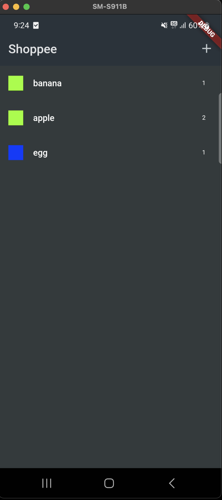
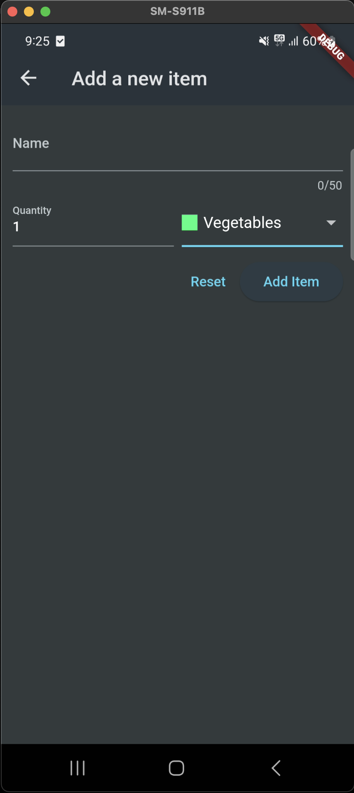

# Shoppee

A Shopping list flutter application.

Users would be able to add grocery items to his/her shopping cart, each item categorized
as defined in models/category.dart Categories enum.

## Screenshots

   
   
   

Reference:
 - https://docs.flutter.dev/cookbook/forms/validation

Requirements:
 - widget tree (layout design).
 - working flutter app.
 - push your solution as PR with your name as the branch name to git@github.rds.lexmark.com:chritan/flutter-training-shoppee.git